# 源人步走 - App 流程與功能詳述

> **概念原型 (Prototype Concept)**

## 📋 專案概述

| 項目           | 詳情                                                 |
| -------------- | ---------------------------------------------------- |
| **版本**       | 0.1 (概念原型階段)                                   |
| **目標平台**   | Web (模擬手機 App 界面，純前端實現)                  |
| **核心技術棧** | HTML, CSS, JavaScript                                |
| **主要目標**   | 透過互動遊戲化方式，提升香港市民對綠色能源認知與實踐 |

## 🎯 總體概述

「源人步走」是一款旨在透過互動遊戲化方式，提升香港市民對綠色能源認知與實踐的教育應用概念。此原型將專注於核心前端交互，模擬主要遊戲流程，**不包含**真實後端、用戶登入、真實 AR 或硬件整合。

## 🔄 核心用戶流程

```mermaid
graph TD
    A[啟動App] --> B[家園視圖]
    B --> C[查看環保評分及能源元素]
    C --> D[升級設施]
    D --> E[消耗對應能源元素，提升等級]
    B --> F[導航至探索視圖]
    F --> G[香港地圖及能源熱點]
    G --> H[點擊熱點]
    H --> I[AR+GPS互動模擬]
    I --> J[收集特定能源元素獎勵]
    B --> K[導航至資訊視圖]
    K --> L[閱讀遊戲概念與教育內容]
```



### 詳細流程步驟

1. **🏠 啟動 App** → 預設進入「家園」視圖
2. **🏠 家園視圖**
   - 查看當前環保評分及可用能源元素 (Solara☀️, Wind🌬️, Aqua💧, Bio-Fuel♻️, Kinetic⚡)
   - 點擊設施升級按鈕，消耗對應能源元素，提升設施等級及環保評分
3. **🗺️ 探索視圖**
   - 查看模擬的香港地圖及能源熱點 (以九龍灣零碳天地為例)
   - 結合 AR 擴增實境與 GPS 定位技術，探索香港各地的綠色能源設施
   - 地圖上顯示玩家角色隨機漫步
   - 地圖上標示「零碳天地」作為能源熱點
   - 當玩家角色走到熱點附近時，可點擊熱點進行互動
4. **📱 AR+GPS 熱點互動 (模擬)**
   - 彈出該熱點的資訊框 (包含標題、描述、臨時方框、獎勵信息)
   - 後續將加入影片片段以模擬 AR 效果
   - 點擊「收集獎勵」按鈕，獲得特定類型的能源元素
   - 能源元素數量更新，並反映在「家園」視圖的資源顯示中
5. **💡 資訊視圖**
   - 閱讀關於遊戲概念、玩法及教育意義的靜態文本

---

## 🌟 能源元素系統 (Energy Elements System)

### 五大能源元素

| 能源元素     | 圖標 | 來源設施/活動        | 主要用途         |
| ------------ | ---- | -------------------- | ---------------- |
| **Solara**   | ☀️   | 太陽能板、日間活動   | 升級太陽能設施   |
| **Wind**     | 🌬️   | 風力發電、戶外探索   | 升級風力設施     |
| **Aqua**     | 💧   | 水力發電、水域熱點   | 升級水力設施     |
| **Bio-Fuel** | ♻️   | 廚餘轉化器、回收活動 | 升級生物燃料設施 |
| **Kinetic**  | ⚡   | 動能發電機、運動活動 | 升級動能設施     |

### 能源元素獲取方式

#### 被動產生 (設施定時產生，需手動領取)

- **太陽能板** → 每小時產生 2 Solara☀️，最大累積量取決於設施等級

  - 等級 1: 最多累積 24 Solara☀️
  - 等級 2: 最多累積 48 Solara☀️
  - 等級 3: 最多累積 72 Solara☀️

- **風力發電機** → 每小時產生 2 Wind🌬️，最大累積量取決於設施等級

  - 等級 1: 最多累積 24 Wind🌬️
  - 等級 2: 最多累積 48 Wind🌬️
  - 等級 3: 最多累積 72 Wind🌬️

- **水力發電機** → 每小時產生 2 Aqua💧，最大累積量取決於設施等級

  - 等級 1: 最多累積 24 Aqua💧
  - 等級 2: 最多累積 48 Aqua💧
  - 等級 3: 最多累積 72 Aqua💧

- **廚餘轉化器** → 每小時產生 2 Bio-Fuel♻️，最大累積量取決於設施等級

  - 等級 1: 最多累積 24 Bio-Fuel♻️
  - 等級 2: 最多累積 48 Bio-Fuel♻️
  - 等級 3: 最多累積 72 Bio-Fuel♻️

- **動能發電機** → 每小時產生 2 Kinetic⚡，最大累積量取決於設施等級
  - 等級 1: 最多累積 24 Kinetic⚡
  - 等級 2: 最多累積 48 Kinetic⚡
  - 等級 3: 最多累積 72 Kinetic⚡

玩家需要定期登入並手動領取累積的能源元素，以避免浪費。

#### 主動收集 (兩種方式)

1. **AR 熱點探索**

- **太陽能相關熱點** → 獎勵 Solara☀️
- **風力相關熱點** → 獎勵 Wind🌬️
- **水力相關熱點** → 獎勵 Aqua💧
- **回收/生物燃料熱點** → 獎勵 Bio-Fuel♻️
- **運動/健身熱點** → 獎勵 Kinetic⚡

2. **能源收集裝置商店**
   | 裝置 | 價格 | 能源類型 | 收集方式 |
   | -------------- | ------------ | --------- | ----------------------------- |
   | **發電鞋墊** | 250 Kinetic⚡ | Kinetic⚡ | 每走 1000 步獲得 5 Kinetic |
   | **動能手環** | 200 Kinetic⚡ | Kinetic⚡ | 每 30 分鐘運動獲得 3 Kinetic |
   | **太陽能手錶** | 300 Solara☀️ | Solara☀️ | 每小時戶外活動獲得 3 Solara |
   | **風力背包** | 350 Wind🌬️ | Wind🌬️ | 每公里步行距離獲得 4 Wind |
   | **水力腕帶** | 280 Aqua💧 | Aqua💧 | 每 30 分鐘運動時間獲得 2 Aqua |

玩家可以選擇通過探索 AR 熱點或購買能源收集裝置來主動收集能源。能源收集裝置根據玩家的日常活動自動轉化成相應的能源元素，可以與 AR 熱點探索方式同時使用，提供更多獲取能源的選擇。

---

## 📁 項目文件結構 (Project Structure)

### 🏗️ 推薦文件夾架構

```
ApeRun-Prototype/
├── 📄 index.html                 # 主頁面文件 (SPA入口)
├── 📄 README.md                  # 項目說明文件
├── 📄 .gitignore                 # Git忽略文件配置
│
├── 📂 css/                       # 樣式文件夾
│   ├── 📄 style.css              # 主樣式文件
│   ├── 📄 variables.css          # CSS變數定義 (可選)
│   ├── 📄 components.css         # 組件樣式 (可選)
│   └── 📄 responsive.css         # 響應式樣式 (可選)
│
├── 📂 js/                        # JavaScript文件夾
│   ├── 📄 script.js              # 主邏輯文件
│   ├── 📄 config.js              # 配置文件 (遊戲設定)
│   ├── 📄 utils.js               # 工具函數 (可選)
│   ├── 📄 home-view.js           # 家園視圖邏輯 (可選模塊化)
│   ├── 📄 explore-view.js        # 探索視圖邏輯 (可選模塊化)
│   └── 📄 info-view.js           # 資訊視圖邏輯 (可選模塊化)
│
├── 📂 assets/                    # 靜態資源文件夾
│   ├── 📂 images/                # 圖片資源
│   │   ├── 📂 hotspots/          # AR熱點圖片
│   │   │   ├── 🖼️ zcb_placeholder.jpg
│   │   │   ├── 🖼️ tpark_placeholder.jpg
│   │   │   └── 🖼️ gc_placeholder.jpg
│   │   ├── 📂 icons/             # 圖標文件
│   │   │   ├── 🖼️ home-icon.svg
│   │   │   ├── 🖼️ explore-icon.svg
│   │   │   ├── 🖼️ info-icon.svg
│   │   │   ├── 🖼️ solar-panel.png
│   │   │   └── 🖼️ compost-bin.png
│   │   ├── 📂 backgrounds/       # 背景圖片
│   │   │   ├── 🖼️ home-bg.jpg
│   │   │   ├── 🖼️ explore-bg.jpg
│   │   │   └── 🖼️ app-bg.jpg
│   │   └── 🖼️ logo.png           # App標誌
│   │
│   ├── 📂 fonts/                 # 字體文件 (可選)
│   │   └── 🔤 custom-font.woff2
│   │
│   └── 📂 data/                  # 靜態數據文件 (可選)
│       ├── 📄 hotspots.json      # 熱點數據
│       └── 📄 game-config.json   # 遊戲配置數據
│
├── 📂 docs/                      # 文檔文件夾
│   ├── 📄 Context.md             # 本文檔
│   ├── 📄 Development-Guide.md   # 開發指南 (可選)
│   └── 📄 API-Reference.md       # API參考 (可選)
│
├── 📂 lib/                       # 第三方庫文件夾 (可選)
│   ├── 📄 font-awesome.min.css   # Font Awesome圖標庫
│   └── 📄 animate.css            # 動畫庫 (可選)
│
└── 📂 tests/                     # 測試文件夾 (可選)
    ├── 📄 unit-tests.js          # 單元測試
    └── 📄 integration-tests.js   # 整合測試
```

### 📋 文件夾說明

| 文件夾/文件           | 用途                             | 必需性  |
| --------------------- | -------------------------------- | ------- |
| **📄 index.html**     | 主頁面，包含所有視圖的 HTML 結構 | ✅ 必需 |
| **📂 css/**           | 所有樣式相關文件                 | ✅ 必需 |
| **📂 js/**            | JavaScript 邏輯文件              | ✅ 必需 |
| **📂 assets/images/** | 圖片和視覺資源                   | ✅ 必需 |
| **📂 docs/**          | 項目文檔和說明                   | 🔶 推薦 |
| **📂 lib/**           | 第三方庫和依賴                   | 🔶 可選 |
| **📂 tests/**         | 測試相關文件                     | 🔶 可選 |

### 🗂️ 架構選項比較

#### 選項 1：簡化結構 (適合原型開發)

```
ApeRun-Prototype/
├── index.html
├── css/
│   └── style.css
├── js/
│   └── script.js
└── assets/
    └── images/
        ├── zcb_placeholder.jpg
        ├── tpark_placeholder.jpg
        └── gc_placeholder.jpg
```

#### 選項 2：模塊化結構 (適合擴展開發)

```
ApeRun-Prototype/
├── index.html
├── css/
│   ├── style.css
│   ├── components.css
│   └── responsive.css
├── js/
│   ├── script.js
│   ├── home-view.js
│   ├── explore-view.js
│   └── config.js
└── assets/
    ├── images/
    └── data/
```

### 📝 文件命名規範

#### HTML 文件

- `index.html` - 主頁面入口
- 使用小寫字母和連字符分隔

#### CSS 文件

- `style.css` - 主樣式文件
- `components.css` - 組件樣式
- `responsive.css` - 響應式樣式
- 使用小寫字母和連字符分隔

#### JavaScript 文件

- `script.js` - 主邏輯文件
- `home-view.js` - 視圖特定邏輯
- `config.js` - 配置文件
- 使用小寫字母和連字符分隔

#### 圖片文件

- `zcb_placeholder.jpg` - 具描述性名稱
- `solar-panel.png` - 使用連字符分隔
- 格式建議：JPG (照片)、PNG (圖標)、SVG (向量圖)

### 🔧 開發環境設置

#### 必需文件

```bash
# 創建基本項目結構
mkdir ApeRun-Prototype
cd ApeRun-Prototype

# 創建主要文件夾
mkdir css js assets docs
mkdir assets/images assets/images/hotspots assets/images/icons

# 創建基本文件
touch index.html
touch css/style.css
touch js/script.js
touch docs/Context.md
touch README.md
```

#### 可選增強

```bash
# 添加進階文件夾
mkdir lib tests
mkdir assets/fonts assets/data
mkdir css/components js/modules

# 創建配置文件
touch .gitignore
touch js/config.js
touch assets/data/hotspots.json
```

---

## 🏗️ 主要功能模塊詳解

### 3.1 主應用程式容器與導航

#### HTML 結構

- **`index.html`** 作為單頁應用 (SPA) 骨架
- **`#app-container`** 主容器
  - 用途：包裹所有應用內容，模擬 iPhone 14 Pro 屏幕
  - 樣式規格：
    - 最大寬度：393px (iPhone 14 Pro 寬度)
    - 最小高度：852px (iPhone 14 Pro 高度)
    - 位置：居中顯示
    - 外觀：白色背景，圓角 (48px)，陰影
    - 定位：`position: relative; overflow: hidden;`
    - 響應式設計：
      - 桌面瀏覽器：保持原始尺寸並居中
      - 移動設備：自動縮放至設備寬度 (max-width: 100vw)
      - 高度：自動適應內容 (min-height: 852px)

#### 底部導航欄

```html
<nav id="bottom-nav">
  <!-- 導航按鈕組 -->
</nav>
```

| 按鈕     | ID            | 圖標                               | 功能                        |
| -------- | ------------- | ---------------------------------- | --------------------------- |
| **家園** | `nav-home`    | <i class="fas fa-home"></i>        | 顯示 `#view-home`，預設選中 |
| **探索** | `nav-explore` | <i class="fas fa-map"></i>         | 顯示 `#view-explore`        |
| **資訊** | `nav-info`    | <i class="fas fa-info-circle"></i> | 顯示 `#view-info`           |

**交互邏輯：**

- 點擊按鈕時，更新按鈕的 `.active` 樣式
- 切換對應的內容視圖

### 3.2 內容視圖容器

#### 視圖結構

```html
<div id="view-home" class="view active-view"></div>
<div id="view-explore" class="view"></div>
<div id="view-info" class="view"></div>
```

#### CSS 樣式規則

- **默認狀態：** `display: none;`
- **激活狀態：** `.active-view` → `display: block;`
- **佈局：** 佔據導航欄以上的剩餘空間 `height: calc(100% - nav_height);`
- **滾動：** `overflow-y: auto;`
- **間距：** 內部應有適當 `padding`

### 3.3 🏠 家園視圖 (`#view-home`)

#### 顯示內容組件

````html
<div id="view-home" class="view active-view">
  <h2>我的綠色家園</h2>

  <!-- 2.5D 生態家園圖片區域 -->
  <div class="eco-home-display">
    
    <p class="image-caption">2.5D 生態家園概念展示</p>
  </div>

  <!-- 資源顯示區 -->
  <div class="resource-display">
    <p>環保評分：<span id="home-eco-score"></span></p>
    <div class="elements-display">
      <p>可用能源元素：</p>
      <div class="element-counters">
        <span class="element-counter"
          >Solara☀️: <span id="solara-count">0</span></span
        >
        <span class="element-counter"
          >Wind🌬️: <span id="wind-count">0</span></span
        >
        <span class="element-counter"
          >Aqua💧: <span id="aqua-count">0</span></span
        >
        <span class="element-counter"
          >Bio-Fuel♻️: <span id="biofuel-count">0</span></span
        >
        <span class="element-counter"
          >Kinetic⚡: <span id="kinetic-count">0</span></span
        >
      </div>
    </div>
  </div>

  <!-- 可用設施區域 (預設解鎖) -->
  <div class="available-facilities">
    <h3>🔧 可用設施</h3>

    <!-- 太陽能板設施 -->
    <div class="home-facility available">
      <h3>☀️ 太陽能板 (等級 <span id="solar-level-display"></span>)</h3>
      <p>目前產能: <span id="solar-rate-display"></span> Solara/小時</p>
      <button id="upgrade-solar-btn" class="upgrade-btn">
        升級太陽能板 (消耗 10 Solara☀️)
      </button>
      <button id="collect-solar-btn" class="collect-btn">
        收集能源 (<span id="solar-accumulated"></span> 可收集)
      </button>
    </div>

    <!-- 風力發電機設施 -->
    <div class="home-facility available">
      <h3>🌬️ 風力發電機 (等級 <span id="wind-level-display"></span>)</h3>
      <p>目前產能: <span id="wind-rate-display"></span> Wind/小時</p>
      <button id="upgrade-wind-btn" class="upgrade-btn">
        升級風力發電機 (消耗 10 Wind🌬️)
      </button>
      <button id="collect-wind-btn" class="collect-btn">
        收集能源 (<span id="wind-accumulated"></span> 可收集)
      </button>
    </div>
  </div>

  <!-- 設施商店區域 (鎖定狀態) -->
  <div class="facility-store">
    <h3>🏪 設施商店 (概念展示)</h3>

    <!-- 水力發電機設施 (鎖定) -->
    <div class="home-facility locked">
      <h3>💧 水力發電機 (等級 1)</h3>
      <p>產能: 2 Aqua/小時</p>
      <button id="buy-aqua-btn" class="buy-btn locked" disabled>
        購買 (需要 500 Solara☀️)
      </button>
      <p class="lock-notice">⚠️ 原型版本中暫不開放購買</p>
    </div>

    <!-- 廚餘轉化器設施 (鎖定) -->
    <div class="home-facility locked">
      <h3>♻️ 廚餘轉化器 (等級 1)</h3>
      <p>產能: 2 Bio-Fuel/小時</p>
      <button id="buy-compost-btn" class="buy-btn locked" disabled>
        購買 (需要 400 Wind🌬️)
      </button>
      <p class="lock-notice">⚠️ 原型版本中暫不開放購買</p>
    </div>

    <!-- 動能發電機設施 (鎖定) -->
    <div class="home-facility locked">
      <h3>⚡ 動能發電機 (等級 1)</h3>
      <p>產能: 2 Kinetic/小時</p>
      <button id="buy-kinetic-btn" class="buy-btn locked" disabled>
        購買 (需要 600 混合能源)
      </button>
      <p class="lock-notice">⚠️ 原型版本中暫不開放購買</p>
    </div>
  </div>

  <p class="info-text">
    💡 提示：設施會定時產生能源，記得定期收集！升級設施可提高產能和存儲上限。
  </p>

  <!-- 能源收集裝置商店按鈕 -->
  <div class="energy-device-store-section">
    <button id="open-device-store-btn" class="store-btn">
      🛒 能源收集裝置商店
    </button>
    <p class="store-hint">購買特殊裝置，讓日常活動也能產生能源！</p>
  </div>
</div>

<!-- 能源收集裝置商店彈窗 -->
<div
  id="energy-device-store-popup"
  class="popup-overlay"
  style="display: none;"
>
  <div class="popup-content device-store-content">
    <div class="popup-header">
      <h3>🛒 能源收集裝置商店</h3>
      <button id="close-device-store-btn" class="close-popup-btn">✕</button>
    </div>

    <div class="popup-body">
      <p class="store-description">
        透過穿戴式裝置，將日常活動轉化為能源元素！每種裝置都有獨特的收集方式。
      </p>

      <!-- 裝置商品列表 -->
      <div class="device-list">
        <!-- 發電鞋墊 -->
        <div class="device-item kinetic-device">
          <div class="device-header">
            <h4>⚡ 發電鞋墊</h4>
            <span class="device-price">250 Kinetic⚡</span>
          </div>
          <div class="device-details">
            <p class="device-description">
              高科技壓電鞋墊，內建微型發電機。每一步都能將腳步的壓力轉化為電能，
              是步行愛好者的最佳夥伴。適合日常通勤和運動時使用。
            </p>
            <div class="device-stats">
              <span class="stat-item"
                >📊 效率：每走 1000 步獲得 5 Kinetic⚡</span
              >
              <span class="stat-item">🔋 能源類型：動能 Kinetic⚡</span>
              <span class="stat-item">⏱️ 收集方式：步行計步</span>
              <span class="stat-item">💪 適用場景：日常步行、運動健身</span>
            </div>
          </div>
          <button
            class="device-buy-btn locked"
            data-device="power-insole"
            disabled
          >
            購買 (原型版本暫不開放)
          </button>
        </div>

        <!-- 動能手環 -->
        <div class="device-item kinetic-device">
          <div class="device-header">
            <h4>⚡ 動能手環</h4>
            <span class="device-price">200 Kinetic⚡</span>
          </div>
          <div class="device-details">
            <p class="device-description">
              智能運動手環，配備動作感測器和微型渦輪發電機。
              能夠識別各種運動模式，將手臂擺動轉化為電能。輕巧舒適，適合長期佩戴。
            </p>
            <div class="device-stats">
              <span class="stat-item"
                >📊 效率：每 30 分鐘運動獲得 3 Kinetic⚡</span
              >
              <span class="stat-item">🔋 能源類型：動能 Kinetic⚡</span>
              <span class="stat-item">⏱️ 收集方式：運動時間計算</span>
              <span class="stat-item">💪 適用場景：健身運動、日常活動</span>
            </div>
          </div>
          <button
            class="device-buy-btn locked"
            data-device="kinetic-wristband"
            disabled
          >
            購買 (原型版本暫不開放)
          </button>
        </div>

        <!-- 太陽能手錶 -->
        <div class="device-item solar-device">
          <div class="device-header">
            <h4>☀️ 太陽能手錶</h4>
            <span class="device-price">300 Solara☀️</span>
          </div>
          <div class="device-details">
            <p class="device-description">
              時尚太陽能智能手錶，表面覆蓋高效太陽能電池片。
              即使在室內燈光下也能持續充電，是綠色生活的完美象徵。具備GPS定位功能。
            </p>
            <div class="device-stats">
              <span class="stat-item"
                >📊 效率：每小時戶外活動獲得 3 Solara☀️</span
              >
              <span class="stat-item">🔋 能源類型：太陽能 Solara☀️</span>
              <span class="stat-item">⏱️ 收集方式：戶外時間計算</span>
              <span class="stat-item">💪 適用場景：戶外活動、日光照射環境</span>
            </div>
          </div>
          <button
            class="device-buy-btn locked"
            data-device="solar-watch"
            disabled
          >
            購買 (原型版本暫不開放)
          </button>
        </div>

        <!-- 風力背包 -->
        <div class="device-item wind-device">
          <div class="device-header">
            <h4>🌬️ 風力背包</h4>
            <span class="device-price">350 Wind🌬️</span>
          </div>
          <div class="device-details">
            <p class="device-description">
              創新風力發電背包，配備可折疊小型風力渦輪。
              背包頂部的風輪在步行時轉動發電，越快的移動速度產生越多能源。輕量化設計。
            </p>
            <div class="device-stats">
              <span class="stat-item"
                >📊 效率：每公里步行距離獲得 4 Wind🌬️</span
              >
              <span class="stat-item">🔋 能源類型：風力 Wind🌬️</span>
              <span class="stat-item">⏱️ 收集方式：移動距離計算</span>
              <span class="stat-item"
                >💪 適用場景：快速步行、騎車、戶外活動</span
              >
            </div>
          </div>
          <button
            class="device-buy-btn locked"
            data-device="wind-backpack"
            disabled
          >
            購買 (原型版本暫不開放)
          </button>
        </div>

        <!-- 水力腕帶 -->
        <div class="device-item aqua-device">
          <div class="device-header">
            <h4>💧 水力腕帶</h4>
            <span class="device-price">280 Aqua💧</span>
          </div>
          <div class="device-details">
            <p class="device-description">
              防水運動腕帶，內建微型水力發電裝置。
              運動時產生的汗液和接觸的水分都能轉化為電能。特別適合游泳和高強度運動。
            </p>
            <div class="device-stats">
              <span class="stat-item"
                >📊 效率：每 30 分鐘運動時間獲得 2 Aqua💧</span
              >
              <span class="stat-item">🔋 能源類型：水力 Aqua💧</span>
              <span class="stat-item">⏱️ 收集方式：運動時間計算</span>
              <span class="stat-item"
                >💪 適用場景：游泳、高強度運動、潮濕環境</span
              >
            </div>
          </div>
          <button
            class="device-buy-btn locked"
            data-device="aqua-wristband"
            disabled
          >
            購買 (原型版本暫不開放)
          </button>
        </div>
      </div>

      <!-- 原型版本說明 -->
      <div class="prototype-notice">
        <h4>⚠️ 原型版本限制說明</h4>
        <ul>
          <li>目前版本僅供展示，無法實際購買裝置</li>
          <li>完整版本將支援裝置購買和佩戴系統</li>
          <li>裝置效果將與真實運動數據整合</li>
          <li>未來將加入裝置升級和自定義功能</li>
        </ul>
      </div>
    </div>
  </div>
</div>

#### JavaScript 邏輯架構 ##### 狀態變數 (State Variables) ```javascript //
遊戲狀態 - 能源元素系統 let energyElements = { solara: 50, // 初始太陽能元素
wind: 30, // 初始風力元素 aqua: 0, // 初始水力元素 (鎖定設施) biofuel: 0, //
初始生物燃料元素 (鎖定設施) kinetic: 0, // 初始動能元素 (鎖定設施) }; let
ecoScore = 10; // 初始環保評分 // 可用設施等級和產能 (僅太陽能和風力) let
availableFacilities = { solar: { level: 1, rate: 2, // 每小時產能 accumulated:
0, // 累積待收集能源 maxStorage: 24, // 最大儲存量 lastUpdate: Date.now(), //
上次更新時間 }, wind: { level: 1, rate: 2, accumulated: 0, maxStorage: 24,
lastUpdate: Date.now(), }, }; // 鎖定設施 (僅供展示，不可購買) let
lockedFacilities = { aqua: { level: 1, rate: 2, cost: 500, costType: "solara" },
compost: { level: 1, rate: 2, cost: 400, costType: "wind" }, kinetic: { level:
1, rate: 2, cost: 600, costType: "mixed" }, }; const upgradeCost = 10; //
升級成本
````

##### 核心函數

**能源累積計算函數：**

```javascript
function updateEnergyAccumulation() {
  const currentTime = Date.now();

  // 更新太陽能累積
  const solarHours =
    (currentTime - availableFacilities.solar.lastUpdate) / (1000 * 60 * 60);
  const solarGenerated = Math.floor(
    solarHours * availableFacilities.solar.rate
  );
  availableFacilities.solar.accumulated = Math.min(
    availableFacilities.solar.accumulated + solarGenerated,
    availableFacilities.solar.maxStorage
  );
  availableFacilities.solar.lastUpdate = currentTime;

  // 更新風力累積
  const windHours =
    (currentTime - availableFacilities.wind.lastUpdate) / (1000 * 60 * 60);
  const windGenerated = Math.floor(windHours * availableFacilities.wind.rate);
  availableFacilities.wind.accumulated = Math.min(
    availableFacilities.wind.accumulated + windGenerated,
    availableFacilities.wind.maxStorage
  );
  availableFacilities.wind.lastUpdate = currentTime;
}
```

**`updateHomeDisplay()` 函數：**

```javascript
function updateHomeDisplay() {
  // 更新能源累積
  updateEnergyAccumulation();

  // 更新環保評分
  document.getElementById("home-eco-score").textContent = ecoScore;

  // 更新能源元素數量
  document.getElementById("solara-count").textContent = energyElements.solara;
  document.getElementById("wind-count").textContent = energyElements.wind;
  document.getElementById("aqua-count").textContent = energyElements.aqua;
  document.getElementById("biofuel-count").textContent = energyElements.biofuel;
  document.getElementById("kinetic-count").textContent = energyElements.kinetic;

  // 更新可用設施狀態
  document.getElementById("solar-level-display").textContent =
    availableFacilities.solar.level;
  document.getElementById("solar-rate-display").textContent =
    availableFacilities.solar.rate;
  document.getElementById("solar-accumulated").textContent =
    availableFacilities.solar.accumulated;

  document.getElementById("wind-level-display").textContent =
    availableFacilities.wind.level;
  document.getElementById("wind-rate-display").textContent =
    availableFacilities.wind.rate;
  document.getElementById("wind-accumulated").textContent =
    availableFacilities.wind.accumulated;
}
```

**設施升級和收集邏輯：**

```javascript
// 太陽能板升級
document
  .getElementById("upgrade-solar-btn")
  .addEventListener("click", function () {
    if (energyElements.solara >= upgradeCost) {
      energyElements.solara -= upgradeCost;
      availableFacilities.solar.level++;
      availableFacilities.solar.rate = availableFacilities.solar.level * 2;
      availableFacilities.solar.maxStorage =
        availableFacilities.solar.level * 24;
      ecoScore += 5;
      updateHomeDisplay();
      alert("太陽能板已升級！");
    } else {
      alert("Solara能源元素不足！");
    }
  });

// 太陽能收集
document
  .getElementById("collect-solar-btn")
  .addEventListener("click", function () {
    if (availableFacilities.solar.accumulated > 0) {
      energyElements.solara += availableFacilities.solar.accumulated;
      availableFacilities.solar.accumulated = 0;
      updateHomeDisplay();
      alert(`成功收集 ${availableFacilities.solar.accumulated} Solara☀️！`);
    } else {
      alert("目前沒有可收集的太陽能！");
    }
  });

// 風力發電機升級
document
  .getElementById("upgrade-wind-btn")
  .addEventListener("click", function () {
    if (energyElements.wind >= upgradeCost) {
      energyElements.wind -= upgradeCost;
      availableFacilities.wind.level++;
      availableFacilities.wind.rate = availableFacilities.wind.level * 2;
      availableFacilities.wind.maxStorage = availableFacilities.wind.level * 24;
      ecoScore += 5;
      updateHomeDisplay();
      alert("風力發電機已升級！");
    } else {
      alert("Wind能源元素不足！");
    }
  });

// 風力能源收集
document
  .getElementById("collect-wind-btn")
  .addEventListener("click", function () {
    if (availableFacilities.wind.accumulated > 0) {
      energyElements.wind += availableFacilities.wind.accumulated;
      availableFacilities.wind.accumulated = 0;
      updateHomeDisplay();
      alert(`成功收集 ${availableFacilities.wind.accumulated} Wind🌬️！`);
    } else {
      alert("目前沒有可收集的風力能源！");
    }
  });

// 鎖定設施購買嘗試 (顯示限制提示)
document.querySelectorAll(".buy-btn.locked").forEach((button) => {
  button.addEventListener("click", function () {
    alert("⚠️ 此功能在原型版本中暫不開放！\n完整版本將支援購買新設施。");
  });
});

// 能源收集裝置商店彈窗控制
document
  .getElementById("open-device-store-btn")
  .addEventListener("click", function () {
    document.getElementById("energy-device-store-popup").style.display = "flex";
  });

document
  .getElementById("close-device-store-btn")
  .addEventListener("click", function () {
    document.getElementById("energy-device-store-popup").style.display = "none";
  });

// 點擊彈窗背景關閉彈窗
document
  .getElementById("energy-device-store-popup")
  .addEventListener("click", function (event) {
    if (event.target === this) {
      this.style.display = "none";
    }
  });

// 裝置購買嘗試處理 (原型版本限制)
document.querySelectorAll(".device-buy-btn.locked").forEach((button) => {
  button.addEventListener("click", function () {
    const deviceType = this.dataset.device;
    const deviceNames = {
      "power-insole": "發電鞋墊",
      "kinetic-wristband": "動能手環",
      "solar-watch": "太陽能手錶",
      "wind-backpack": "風力背包",
      "aqua-wristband": "水力腕帶",
    };

    alert(
      `⚠️ ${deviceNames[deviceType]} 在原型版本中暫不開放購買！\n\n完整版本功能預覽：\n• 消耗對應能源元素購買裝置\n• 自動收集日常活動產生的能源\n• 裝置升級系統\n• 佩戴效果視覺化`
    );
  });
});
```

### 3.4 🗺️ 探索視圖 (`#view-explore`) - AR+GPS 模擬

#### 顯示內容結構

```html
<div id="view-explore" class="view">
  <h2>香港綠蹤遊 (AR+GPS概念模擬)</h2>
  <p class="guide-text">
    結合擴增實境與定位技術，探索香港的綠色能源設施 - 零碳天地
  </p>

  <!-- 地圖模擬區域 - 單一熱點 -->
  <div id="map-simulation">
    <div class="map-container">
      <h3>🗺️ 九龍灣區域地圖</h3>
      <div class="hotspot-location">
        <button class="hotspot-btn main-hotspot" data-hotspot="zcb">
          🏢 探索：零碳天地 (ZCB)
        </button>
        <p class="location-desc">香港首座零碳建築，展示多種綠色建築技術</p>
      </div>
    </div>
  </div>

  <!-- AR資訊彈窗 -->
  <div id="ar-popup-explore" style="display: none;">
    <h3 id="ar-popup-title-explore"></h3>
    <p id="ar-popup-desc-explore"></p>
    
    <p>
      獎勵：<span id="ar-popup-reward-explore"></span>
      <span id="ar-popup-reward-type"></span>
    </p>
    <button id="collect-reward-btn-explore">收集獎勵</button>
    <button id="close-ar-popup-btn-explore">關閉</button>
  </div>

  <p class="info-text">
    💡
    提示：此為概念原型，僅展示單一AR熱點體驗。完整版本將包含更多香港綠色能源地點。
  </p>
</div>
```

#### JavaScript 邏輯實現

##### 熱點數據結構

```javascript
const hotspotDataExplore = {
  // 零碳天地 - 唯一可用熱點
  zcb: {
    title: "零碳天地",
    desc: "香港首座零碳建築，展示多種綠色建築技術，包括太陽能板、風力發電和生物燃料系統。",
    img: "assets/images/hotspots/zcb_placeholder.jpg",
    reward: { type: "solara", amount: 25 },
    energyType: "solar",
  },
};
```

##### 事件監聽器

**熱點按鈕點擊事件：**

```javascript
document
  .querySelector(".hotspot-btn")
  .addEventListener("click", function (event) {
    const hotspotId = event.target.dataset.hotspot;
    const data = hotspotDataExplore[hotspotId];

    // 更新彈窗內容
    document.getElementById("ar-popup-title-explore").textContent = data.title;
    document.getElementById("ar-popup-desc-explore").textContent = data.desc;
    document.getElementById("ar-popup-reward-explore").textContent =
      data.reward.amount;
    document.getElementById("ar-popup-reward-type").textContent =
      getEnergyElementDisplay(data.reward.type);

    // 設置圖片
    const img = document.getElementById("ar-popup-img-explore");
    img.src = data.img;
    img.style.display = "block";

    // 存儲當前獎勵信息
    currentReward = data.reward;

    // 顯示彈窗
    document.getElementById("ar-popup-explore").style.display = "block";
  });
```

**獎勵收集事件：**

```javascript
document
  .getElementById("collect-reward-btn-explore")
  .addEventListener("click", function () {
    // 根據獎勵類型增加對應的能源元素
    switch (currentReward.type) {
      case "solara":
        energyElements.solara += currentReward.amount;
        break;
      case "wind":
        energyElements.wind += currentReward.amount;
        break;
      case "aqua":
        energyElements.aqua += currentReward.amount;
        break;
      case "biofuel":
        energyElements.biofuel += currentReward.amount;
        break;
      case "kinetic":
        energyElements.kinetic += currentReward.amount;
        break;
    }

    updateHomeDisplay();
    document.getElementById("ar-popup-explore").style.display = "none";
    alert(
      `獎勵已收集！您獲得了 ${currentReward.amount} ${getEnergyElementDisplay(
        currentReward.type
      )}`
    );
  });

// 關閉彈窗事件
document
  .getElementById("close-ar-popup-btn-explore")
  .addEventListener("click", function () {
    document.getElementById("ar-popup-explore").style.display = "none";
  });

// 輔助函數：獲取能源元素顯示名稱
function getEnergyElementDisplay(type) {
  const displayNames = {
    solara: "Solara☀️",
    wind: "Wind🌬️",
    aqua: "Aqua💧",
    biofuel: "Bio-Fuel♻️",
    kinetic: "Kinetic⚡",
  };
  return displayNames[type] || type;
}
```

### 3.5 💡 資訊視圖 (`#view-info`)

#### 內容結構

```html
<div id="view-info" class="view">
  <h2>關於「源人步走」</h2>

  <section class="info-section">
    <h3>🏆 團隊資訊</h3>
    <p>
      <strong>團隊名稱：</strong>綠色猿人<br />
      <strong>所屬院校：</strong>香港中文大學<br />
      <strong>參賽項目：</strong>三菱電機綠續創科盃2025
    </p>
  </section>

  <section class="info-section">
    <h3>🎮 遊戲概念</h3>
    <p>透過遊戲化互動，讓玩家在虛擬世界中體驗綠色能源的魅力</p>
  </section>

  <section class="info-section">
    <h3>🎯 玩法說明</h3>
    <ul>
      <li><strong>家園建設：</strong>升級各種綠色能源設施</li>
      <li><strong>AR探索：</strong>發現香港各地的綠色能源熱點</li>
      <li><strong>源動裝備：</strong>透過步行計步產生能量</li>
    </ul>
  </section>

  <section class="info-section">
    <h3>🌱 教育目標</h3>
    <p>
      提升市民對綠色能源的認知，推廣綠色生活方式，提升市民對綠色能源的接受程度和興趣
    </p>
  </section>

  <section class="info-section">
    <h3>⚙️ 原型說明</h3>
    <p>此為概念原型，專注於核心功能概念展示，未包含完整後端系統...</p>
  </section>
</div>
```

---

## 🎨 樣式與資源

### CSS 架構 (`css/style.css`)

#### 設計原則

- **Mobile-First** 設計原則
- **綠色能源主題** 色彩搭配
- **簡潔明亮** 的視覺風格
- **響應式** 佈局設計

#### 主要樣式組件

- 全局樣式
- App 容器樣式
- 導航欄樣式
- 視圖容器樣式
- 按鈕與互動元素樣式
- 彈窗樣式
- 能源收集裝置商店樣式

#### 能源收集裝置商店 CSS 規格

```css
/* 商店按鈕樣式 */
.energy-device-store-section {
  margin: 20px 0;
  text-align: center;
}

.store-btn {
  background: linear-gradient(135deg, #4caf50, #45a049);
  color: white;
  border: none;
  padding: 12px 24px;
  border-radius: 25px;
  font-size: 16px;
  font-weight: bold;
  cursor: pointer;
  box-shadow: 0 4px 8px rgba(0, 0, 0, 0.2);
  transition: all 0.3s ease;
}

.store-btn:hover {
  transform: translateY(-2px);
  box-shadow: 0 6px 12px rgba(0, 0, 0, 0.3);
}

.store-hint {
  font-size: 14px;
  color: #666;
  margin-top: 8px;
}

/* 彈窗覆蓋層 */
.popup-overlay {
  position: fixed;
  top: 0;
  left: 0;
  width: 100%;
  height: 100%;
  background-color: rgba(0, 0, 0, 0.5);
  display: flex;
  justify-content: center;
  align-items: center;
  z-index: 1000;
}

/* 彈窗內容容器 */
.device-store-content {
  background: white;
  width: 90%;
  max-width: 500px;
  max-height: 80vh;
  border-radius: 15px;
  overflow: hidden;
  box-shadow: 0 10px 30px rgba(0, 0, 0, 0.3);
}

/* 彈窗標題區 */
.popup-header {
  background: linear-gradient(135deg, #4caf50, #45a049);
  color: white;
  padding: 15px 20px;
  display: flex;
  justify-content: space-between;
  align-items: center;
}

.popup-header h3 {
  margin: 0;
  font-size: 18px;
}

.close-popup-btn {
  background: none;
  border: none;
  color: white;
  font-size: 20px;
  cursor: pointer;
  width: 30px;
  height: 30px;
  border-radius: 50%;
  display: flex;
  align-items: center;
  justify-content: center;
}

.close-popup-btn:hover {
  background-color: rgba(255, 255, 255, 0.2);
}

/* 彈窗主體內容 */
.popup-body {
  padding: 20px;
  max-height: 60vh;
  overflow-y: auto;
}

.store-description {
  font-size: 14px;
  color: #666;
  margin-bottom: 20px;
  text-align: center;
}

/* 裝置列表 */
.device-list {
  display: flex;
  flex-direction: column;
  gap: 15px;
}

/* 裝置項目 */
.device-item {
  border: 2px solid #e0e0e0;
  border-radius: 10px;
  padding: 15px;
  transition: all 0.3s ease;
}

.device-item:hover {
  border-color: #4caf50;
  box-shadow: 0 4px 8px rgba(0, 0, 0, 0.1);
}

/* 不同能源類型的邊框顏色 */
.kinetic-device {
  border-left: 4px solid #ff9800;
}
.solar-device {
  border-left: 4px solid #ffc107;
}
.wind-device {
  border-left: 4px solid #03a9f4;
}
.aqua-device {
  border-left: 4px solid #00bcd4;
}

/* 裝置標題區 */
.device-header {
  display: flex;
  justify-content: space-between;
  align-items: center;
  margin-bottom: 10px;
}

.device-header h4 {
  margin: 0;
  font-size: 16px;
  color: #333;
}

.device-price {
  background: #f0f0f0;
  padding: 4px 8px;
  border-radius: 5px;
  font-size: 12px;
  font-weight: bold;
  color: #666;
}

/* 裝置詳情 */
.device-details {
  margin-bottom: 15px;
}

.device-description {
  font-size: 13px;
  color: #555;
  line-height: 1.4;
  margin-bottom: 10px;
}

.device-stats {
  display: flex;
  flex-direction: column;
  gap: 4px;
}

.stat-item {
  font-size: 12px;
  color: #777;
  padding: 2px 0;
}

/* 購買按鈕 */
.device-buy-btn {
  width: 100%;
  padding: 10px;
  border: none;
  border-radius: 6px;
  font-size: 14px;
  font-weight: bold;
  cursor: pointer;
  transition: all 0.3s ease;
}

.device-buy-btn.locked {
  background: #ccc;
  color: #666;
  cursor: not-allowed;
}

.device-buy-btn.locked:hover {
  background: #bbb;
}

/* 原型版本說明 */
.prototype-notice {
  background: #fff3cd;
  border: 1px solid #ffeaa7;
  border-radius: 8px;
  padding: 15px;
  margin-top: 20px;
}

.prototype-notice h4 {
  margin: 0 0 10px 0;
  color: #856404;
  font-size: 14px;
}

.prototype-notice ul {
  margin: 0;
  padding-left: 20px;
}

.prototype-notice li {
  font-size: 12px;
  color: #856404;
  margin-bottom: 5px;
}

/* 響應式設計 */
@media (max-width: 480px) {
  .device-store-content {
    width: 95%;
    margin: 10px;
  }

  .popup-body {
    padding: 15px;
  }

  .device-item {
    padding: 12px;
  }

  .device-header {
    flex-direction: column;
    align-items: flex-start;
    gap: 5px;
  }
}
```

---

## 💻 JavaScript 組織與狀態管理

### 文件結構選項

#### 選項 1：單一文件架構

```
script.js (包含所有邏輯)
├── DOMContentLoaded 處理
├── 導航邏輯
├── 全局狀態變數
├── 家園視圖邏輯
├── 探索視圖邏輯
└── 通用更新函數
```

#### 選項 2：模塊化架構

```
script.js (主控制器)
├── 初始化邏輯
├── 導航控制
├── 全局狀態管理
└── 全局更新函數

home-view.js (家園功能)
├── updateHomeDisplay()
└── 設施升級邏輯

explore-view.js (探索功能)
├── 熱點數據
├── AR彈窗邏輯
└── 獎勵收集邏輯
```

### 核心函數設計

```javascript
// 全局狀態管理
function updateAllDisplays() {
  updateHomeDisplay();
  // 其他視圖更新函數...
}

// 導航切換邏輯
function switchView(targetViewId) {
  // 隱藏所有視圖
  // 顯示目標視圖
  // 更新導航按鈕狀態
}
```

---

## ⚠️ 預期原型限制

| 限制項目        | 說明                                             |
| --------------- | ------------------------------------------------ |
| **數據持久化**  | 無後端，狀態僅存在於瀏覽器會話中，刷新頁面將重置 |
| **用戶系統**    | 無需登入或註冊功能                               |
| **AR+GPS 功能** | 點擊模擬，不涉及攝像頭、真實 AR 渲染或 GPS 定位  |
| **計步功能**    | 僅為概念提示，無實際整合                         |
| **能源系統**    | 簡化為「能源元素」通用資源                       |

---

## 📝 開發者注意事項

### 🔧 技術要求

- [ ] 嚴格按照指定的 **ID** 和 **Class** 名稱創建 HTML 元素
- [ ] 確保 JavaScript 選擇器能正確工作
- [ ] CSS 樣式保持簡潔，易於理解和修改
- [ ] JavaScript 代碼添加適當註釋

### 🐛 調試建議

- [ ] 頻繁使用瀏覽器開發者工具的控制台檢查錯誤
- [ ] 在關鍵函數中添加 `console.log()` 進行調試
- [ ] 測試所有交互功能的正常運作

### 📁 資源準備

- [ ] 預先準備佔位圖片並放置在 `assets/images/` 文件夾
- [ ] 確保圖片文件名與代碼中的引用一致
- [ ] 優化圖片大小以提升加載速度

### 🔍 測試檢查清單

- [ ] 導航切換功能正常
- [ ] 設施升級邏輯正確
- [ ] 能源元素數量更新正確
- [ ] AR 彈窗顯示和關閉正常
- [ ] 獎勵收集功能正常
- [ ] 響應式設計在不同屏幕尺寸下正常顯示

---

_此文檔為「源人步走」概念原型的完整技術規格，包含所有必要的實現細節和開發指導。_
